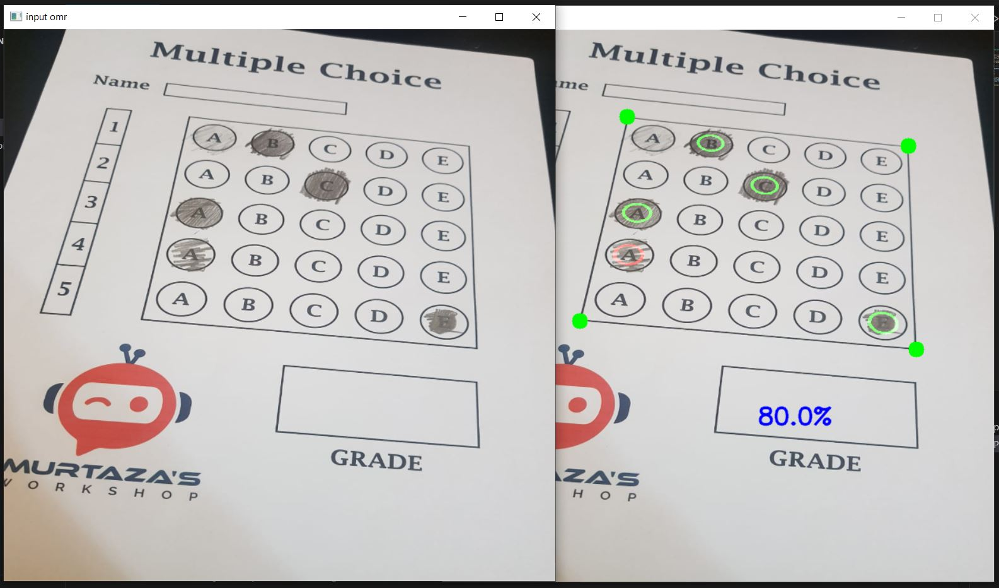
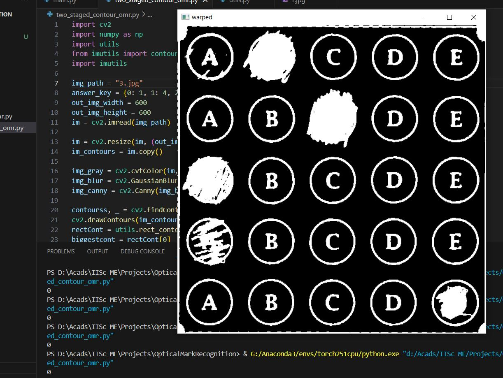
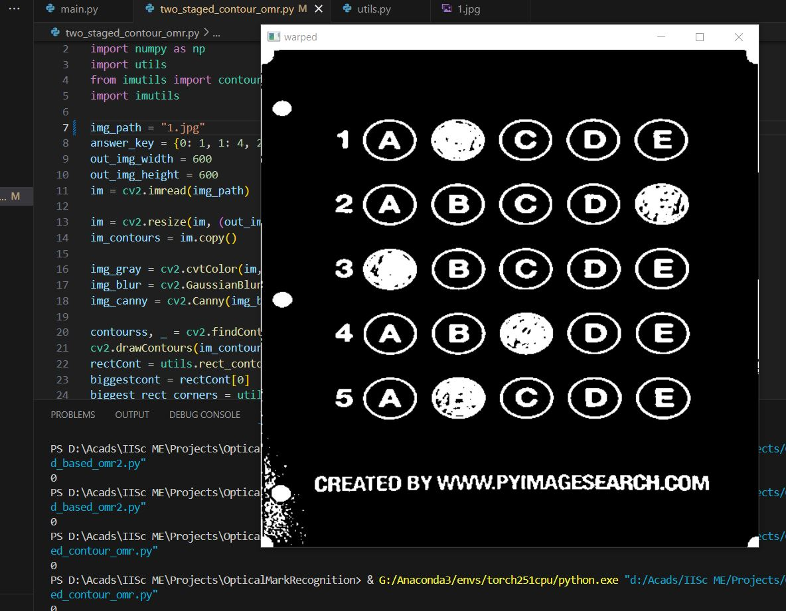

# Automated Optical Marksheet Evaluation
Experimenting with different OMR methods for their roubustness on marksheets with differnet styles.

#### *`Output of threshold and image split based method`*
In this method after extracting OMR document from the input image, answer bubbles are detected based on threshold and  
their location is detected based on splitting image into grid based on number of questions and choices

#### *`Output of two staged contour method`*
  

#### *Note on methods tried*
Methods tried so far and several others researched on internet are mainly based on thresholding for answer bubble detection  
and their `location finding is based on some heuristic which only seem to work for particular types OMR sheet`

# Future Work
* [ ] Use an object detection model like YOLO/SSD etc for detecting bubbles and their location, group them based on questions
      they belong to and calculate score accordingly

# Requirements
os  
cv2  
imutils  
numpy
# References
1st method Guided by this [Youtube Tutorial](https://www.youtube.com/watch?v=0IqCOPlGBTs)  
2nd method Guided by this [Youtube Tutorial](https://www.youtube.com/watch?v=1TBLc8IrLvk)  
