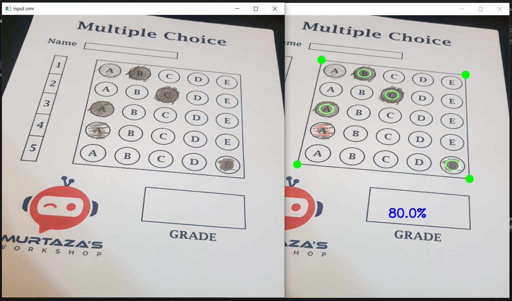
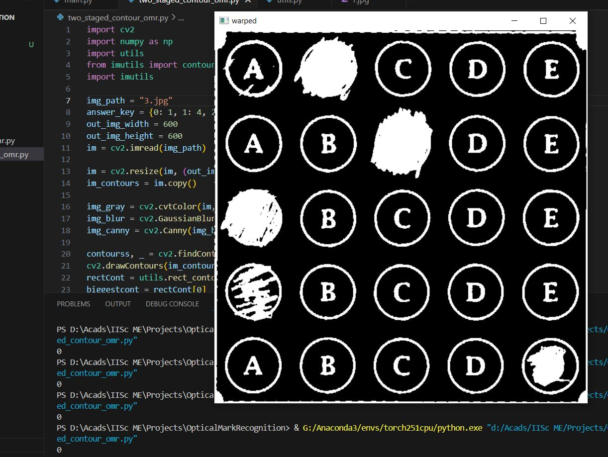
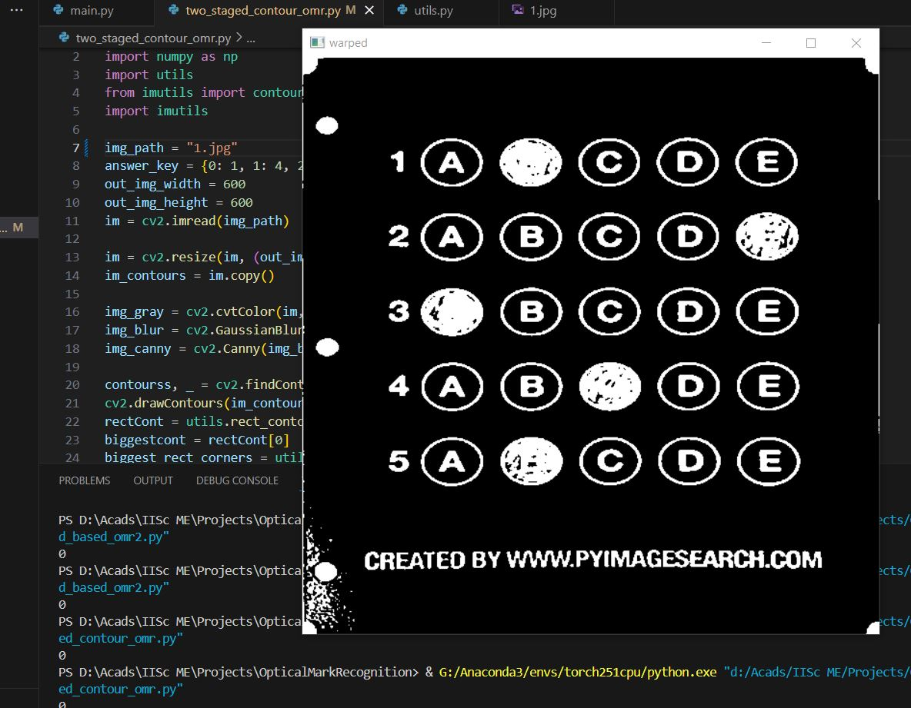

# Automated Optical Marksheet Evaluation
Experimenting with different OMR methods for their roubustness on marksheets with differnet styles.

#### *`Output of threshold and image split based method`*
In this method after extracting OMR document from the input image, answer bubbles are detected based on threshold and  
their location is detected based on splitting image into grid based on number of questions and choices


#### *`Output of two staged contour method`*
  


## *Note on methods tried*
Methods tried so far and several others researched on internet are mainly based on thresholding for answer bubble detection  
and their `location finding is based on some heuristic which only seem to work for particular types OMR sheet`

# Future Work
* [ ] Use an object detection model like YOLO/SSD etc for detecting bubbles and their location, group them based on questions
      they belong to and calculate score accordingly

# Requirements
os  
cv2  
imutils  
numpy
# References
1st method Guided by this [Youtube Tutorial](https://www.youtube.com/watch?v=0IqCOPlGBTs)  
2nd method Guided by this [Youtube Tutorial](https://www.youtube.com/watch?v=1TBLc8IrLvk)  

## AI-based OMR pipeline (new)
This repository now includes a model-ready grading module in `ai_based_omr.py` to support layout-robust OMR.

### Implemented components
- `YOLOBubbleDetector`: runs a trained Ultralytics YOLO detector and returns normalized bubble detections.
- `SSDBubbleDetector`: runs OpenCV DNN SSD-style detectors and returns normalized bubble detections.
- `ONNXBubbleFillClassifier`: runs an ONNX binary classifier (`filled` vs `empty`) per bubble crop.
- `PixelDensityBubbleFillClassifier`: classical CV fallback classifier for fill estimation.
- `grade_sheet_from_detector(...)`: full detector + classifier + grading pipeline.

### Grading behavior
- Bubbles are grouped into rows by y-axis clustering and sorted left-to-right as options.
- Per-question statuses are returned as one of:
  - `valid_marked`
  - `blank`
  - `multi_marked`
  - `low_confidence`
  - `invalid_row`

### Example with YOLO detector + ONNX classifier
```python
from ai_based_omr import (
    YOLOBubbleDetector,
    ONNXBubbleFillClassifier,
    grade_sheet_from_detector,
)

detector = YOLOBubbleDetector(
    model_path="models/bubble_detector.pt",
    bubble_class_name="bubble",
    confidence_threshold=0.25,
)
classifier = ONNXBubbleFillClassifier(
    model_path="models/fill_classifier.onnx",
    input_size=(32, 32),
    mark_threshold=0.5,
)

result = grade_sheet_from_detector(
    image_path="sheet.jpg",
    detector=detector,
    answer_key=[1, 2, 0, 1, 4],
    classifier=classifier,
    expected_options_per_question=5,
)
print(result.score_percent)
```

### Example with SSD detector + CV fallback classifier
```python
from ai_based_omr import (
    SSDBubbleDetector,
    PixelDensityBubbleFillClassifier,
    grade_sheet_from_detector,
)

detector = SSDBubbleDetector(
    model_path="models/ssd_bubble.onnx",
    bubble_class_id=1,
    confidence_threshold=0.25,
)
classifier = PixelDensityBubbleFillClassifier(mark_threshold=0.45)

result = grade_sheet_from_detector(
    image_path="sheet.jpg",
    detector=detector,
    answer_key=[1, 2, 0, 1, 4],
    classifier=classifier,
    expected_options_per_question=5,
)
print(result.answers)
```

### Run end-to-end from `main.py`
`main.py` now calls the AI grading pipeline first (`grade_sheet_from_detector`) and also computes legacy score for side-by-side comparison.

Default run (no model files needed):
- detector: `WarpedGridBubbleDetector`
- classifier: `PixelDensityBubbleFillClassifier`

You can switch to model-backed inference using environment variables:

```bash
# YOLO + ONNX fill classifier
OMR_DETECTOR_MODE=yolo \
OMR_YOLO_MODEL=models/bubble_detector.pt \
OMR_BUBBLE_CLASS=bubble \
OMR_FILL_ONNX=models/fill_classifier.onnx \
python main.py
```

```bash
# SSD + Pixel-density fill classifier
OMR_DETECTOR_MODE=ssd \
OMR_SSD_MODEL=models/ssd_bubble.onnx \
python main.py
```
